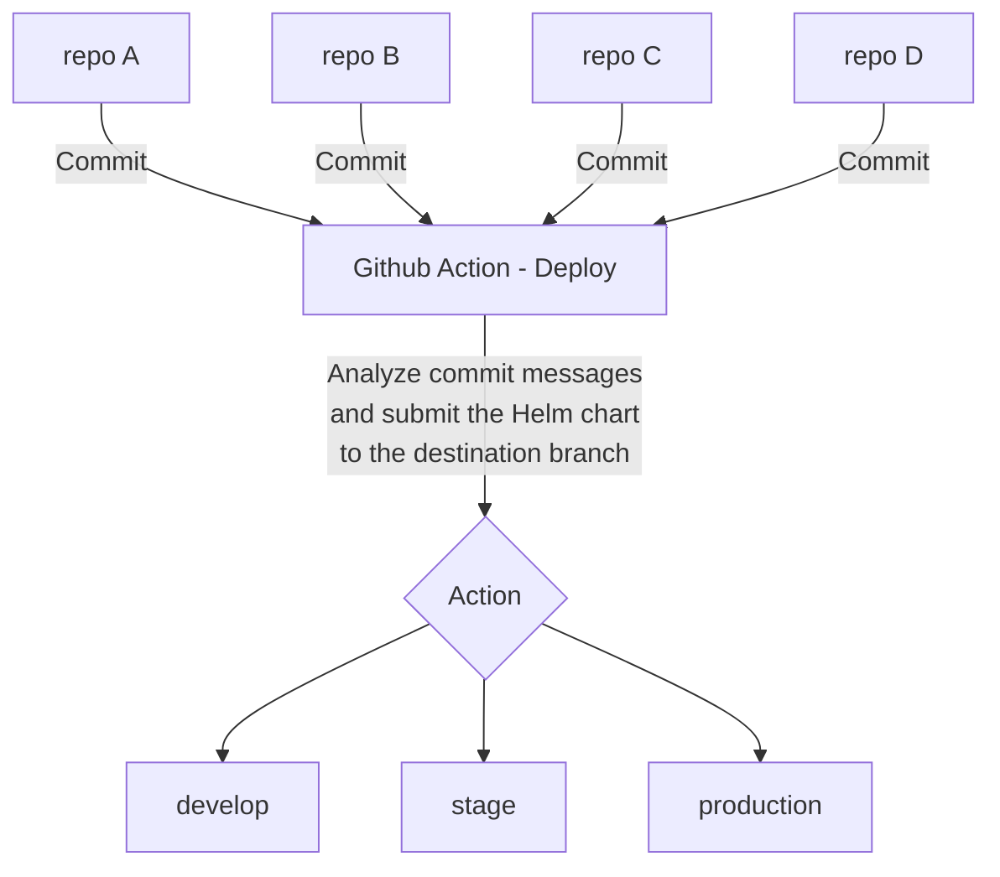

# .github - Generic GitHub Actions

This **.github** repository is dedicated to hosting generic and reusable GitHub Actions. The focus is on providing a library of actions that can be easily integrated into various CI/CD workflows, optimizing processes, and enhancing efficiency.

## Featured: [app-helm-release.yaml](.github/workflows/app-helm-release.yaml)

The highlight is the action **[app-helm-release.yaml](.github/workflows/app-helm-release.yaml)**, conceived and detailed in the article “**Simplifying and Optimizing Processes with Reusable GitHub Actions Pipelines**”. This action serves as a practical example to demonstrate the simplification and optimization of CI/CD workflows.

### Action Architecture

The architecture of the action is illustrated below:

## License

This project is distributed under the [MIT License](LICENSE). For more details, please see the `LICENSE` file.

## About the Author

I am Eduardo Fernandes de Souza, the creator of this repository. Check out my article [Refactoring with GitHub Actions: Reusable Pipelines](https://medium.com/@eduardo854/refactoring-with-github-actions-reusable-pipelines-00b8374e34a5) on Medium.

For more publications, visit my profile on [MEDIUM](https://medium.com/@eduardo854).

Don't miss any updates, **[SUBSCRIBE HERE](https://medium.com/@eduardo854/subscribe)** to be notified about new posts.
